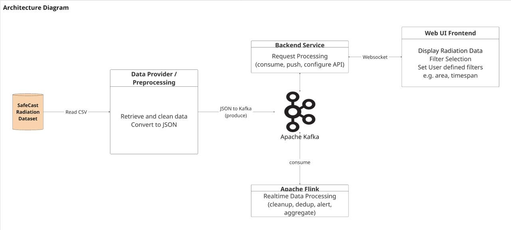

# Radiation Tracking Project (Topic C)

A distributed pipeline for processing, classifying, and visualizing radiation data from the Safecast dataset in real time.

## Architecture



The Safecast radiation dataset is read from CSV by the **Data Provider**, which cleans it and produces JSON to **Apache Kafka**. **Apache Flink** consumes the raw stream for real-time processing (cleanup, dedup, alerting, aggregation). The **Backend Service** consumes the processed streams and pushes events to the **Web UI Frontend** over a WebSocket. Area/timespan filters are **per-client view state** (ADR-017): each browser narrows its own `/recent` queries and WebSocket stream, REMAP-style, without affecting other clients; the admin-only config API carries just the global alert thresholds to Flink.

---

## Quick Start — Local

**Prerequisites:** Docker and Docker Compose installed (no other tools needed).

```bash
# 1. Clone the repo
git clone https://collaborating.tuhh.de/e-19/teaching/bd26_project_t2_c.git
cd bd26_project_t2_c

# 2. (Optional) copy the environment template — defaults work out of the box
cp .env.example .env

# 3. Bring up the full stack
docker compose up --build
```

This will spin up:
- **Kafka** (KRaft mode) on port `9092` (external `29092`)
- **Flink** JobManager (UI on port `8081`) + TaskManager
- `flink-job` — one-shot submitter that runs the radiation tracking job on the cluster
- **Backend** FastAPI service on port `8000`
- **Frontend** React/Leaflet dashboard on port `5173`
- **Data Provider** stream generator (metrics on port `8001`)

Once running, navigate to **<http://localhost:5173>** to view the live radiation dashboard.

> **Status note:** The full pipeline runs end-to-end — the Data Provider streams to Kafka, the
> Flink job cleans/dedupes/classifies into `radiation.clean`, aggregates geo-bucket blobs into
> `radiation.aggregated` (windowed by `captured_at` event time), and emits sustained-high
> `radiation.alerts` — all consumed by the Backend and pushed to the map. Area/timespan
> narrowing is per-client on the backend read path (ADR-017); the pipeline's region filter
> remains as an operator-set ingest bound.

### Using the full 29 GB Safecast dataset locally

```bash
# Point the provider at the full dataset (bind-mounted, never copied into the image)
CSV_FILE=./measurements-out.csv docker compose up --build

# Or replay only the Fukushima window at high speed
CSV_FILE=./measurements-out.csv BACKFILL_PRESET=fukushima PRODUCER_SPEED=200x docker compose up --build
```

---

## Quick Start — Cloud (DigitalOcean Droplet)

The production stack is a single Dockerized `docker compose` deployment on one DO droplet.
The droplet, prod compose override, reverse proxy, Kafka topic provisioning on the droplet via `scripts/provision_topics.py` are owned by **M3**.
The base compose (`docker-compose.yml`) + a prod override will wire TLS, CORS, the `CONFIG_WRITE_TOKEN`,
and the `VITE_API_BASE_URL` build arg for the SPA.

### Access the live deployment

**Public URL:** _TBD — filled in here once M3 brings the droplet up._
*(Placeholder; not yet live. Do not rely on any URL until this line is updated.)*

### Pull pre-built images from DockerHub

Each service will be published publicly to DockerHub for the `v1.0-final` release (Week 7).
Once pushed, you can pull them without building — the target coordinates are:

```bash
# tba
```

### Running the full stack against the cloud images (no build required)

```bash
# Set the required env vars (or put them in .env)
export KAFKA_BOOTSTRAP_SERVERS=<your-broker>:9092

# Pull and start (no --build needed — images are pulled from DockerHub)
docker compose pull
docker compose up
```

### Deploying / re-deploying to the droplet

```bash
# On the droplet (see docs/deploy/droplet.md for the full runbook)
docker compose -f docker-compose.yml -f docker-compose.prod.yml up -d --build
```

The droplet `.env` must set `PUBLIC_URL=https://<domain>`, `BIND_HOST=127.0.0.1`,
`CORS_ORIGINS=<PUBLIC_URL>` and `CONFIG_WRITE_TOKEN` — see `.env.example` and
[`docs/deploy/droplet.md`](docs/deploy/droplet.md).

### Running the prod stack locally (prod-parity smoke test)

The same two-file command works on a laptop, **but `PUBLIC_URL` decides what origin the
frontend bundle calls** — with the droplet domain baked in, a local browser talks to the
droplet, not your local stack (symptom: the map stays on "Reconnecting…" with no markers).
For a local run, point it at localhost first:

```bash
# In .env: Caddy then serves plain HTTP on :80 (no TLS attempt), same-origin API + WS
PUBLIC_URL=http://localhost
CORS_ORIGINS=http://localhost

docker compose -f docker-compose.yml -f docker-compose.prod.yml up -d --build
```

Then open **<http://localhost>** (the Caddy proxy — not :5173, which serves the same bundle
but is only the raw nginx container). Switch the two values back to the droplet domain
before deploying.

See [`docs/cloud/kafka.md`](docs/cloud/kafka.md) for managed-Kafka (Confluent / Redpanda) setup.

---

## Module Sections

### Data Provider (M1) — ✅ Implemented
Streams the Safecast measurements CSV into Kafka without loading the full file into memory.
- **Chunked CSV reader** (`csv_reader.py`): reads and sorts the dataset in bounded batches, ordered by timestamp.
- **JSON mapper** (`mapper.py`): converts each row into the `radiation.raw` event schema.
- **Kafka producer** (`producer.py`): publishes events to the `radiation.raw` topic.
- **Replay speed control** via `--speed`: fixed rate (`--speed 500` = 500 events/sec), wall-clock multiplier (`--speed 10x`), or `--speed max` (unthrottled — full-dataset replay / load testing).
- **Backfill span selector** via `--start` / `--end`: publish only events whose `captured_at` falls within the given ISO8601 window. The CSV is still read sequentially; rows outside the window are skipped before being sent to Kafka, so a targeted replay does not flood the topic with the full 29 GB of data.
- **Named presets** via `--preset`: shorthand for well-known event windows. Currently supported: `fukushima` (2011-03-11 → 2011-04-30, covering the disaster onset and the first month of elevated Safecast field measurements).
- **Throughput tuning** (`--producer-batch-size` / `--producer-linger-ms` / `--compression-type`, env `KAFKA_BATCH_SIZE` / `KAFKA_LINGER_MS` / `KAFKA_COMPRESSION_TYPE`): defaults `64 KiB / 20 ms / lz4` give ~2.1× the kafka-python baseline while keeping `acks=all` and event ordering. Measured in [docs/perf/producer-load-test.md](docs/perf/producer-load-test.md); rationale in [ADR-012](docs/decisions/ADR-012-producer-perf-tuning.md). Reproduce with `python scripts/producer_load_test.py`.

Run standalone:
```bash
# Full stream at 10× real-time
python -m data_provider --csv data/sample.csv --speed 10x

# Replay only the Fukushima window at 200× real-time
python -m data_provider --csv measurements-out.csv --preset fukushima --speed 200x

# Custom window
python -m data_provider --csv measurements-out.csv \
  --start 2011-03-11T00:00:00 --end 2011-04-30T23:59:59 --speed 200x
```

**Cloud image** (`data-provider/Dockerfile.cloud`): a self-contained variant that bakes the `data/sample.csv` slice into the image (at `/data/demo.csv`), so the producer runs on a cloud host with **no mounted dataset** — unlike the local compose image, which bind-mounts the CSV. Build from the **repo root** (the context needs `data/`), then point it at the cloud broker:
```bash
docker build -f data-provider/Dockerfile.cloud -t <user>/radiation-data-provider:cloud .
docker run --rm -e KAFKA_BOOTSTRAP_SERVERS=<broker-host:port> \
  <user>/radiation-data-provider:cloud
```
Defaults baked in (override with `-e`): `CSV_PATH=/data/demo.csv`, `PRODUCER_SPEED=50`, `KAFKA_TOPIC=radiation.raw`, `METRICS_PORT=8001`. `KAFKA_BOOTSTRAP_SERVERS` has no default — it must be supplied. A root [`.dockerignore`](.dockerignore) keeps the 29 GB dataset out of the build context.

### Flink Processing (M2 & M3)
The Flink job (`flink-jobs/radiation_tracking_job.py`) is the real-time processing core. It reads
`radiation.raw` under event-time watermarks and runs the full operator chain: parse/validate →
null-CPM + CPM-range filters → per-sensor dedup (keyed state + TTL) → threshold classifier
(`config.updates` broadcast) → `radiation.clean`. Two map-facing branches run off an area/timespan
region filter: geo-bucket aggregation → `radiation.aggregated`, and alert detection
→ `radiation.alerts`. The alert stream carries two kinds (by `reason`): sustained-high alerts
(enriched with their geohash cell's stats via an alerts × aggregated join) and rising-trend
alerts (cells whose `cpm_avg` climbs across N windows). `docker compose up` runs it on the
cluster via the `flink-job` submitter. See [`flink-jobs/README.md`](flink-jobs/README.md) and
the decision logs in `docs/decisions/` (ADR-003 dedup, ADR-004 aggregation, ADR-005 alerts,
ADR-006 area/timespan filter, ADR-007 hot-region join, ADR-008 trend detector, ADR-009 rolling
z-score anomaly, ADR-010 cloud Kafka, ADR-015 cloud Flink checkpointing).

The cloud session cluster runs on a single DigitalOcean droplet with RocksDB-backed checkpoints
persisted to a shared `flink-state` Docker volume, so a restarted TaskManager/JobManager
recovers keyed state without replaying from the Kafka earliest offset. Checkpoint config is
env-driven (`FLINK_CHECKPOINT_DIR`, `FLINK_STATE_BACKEND`) — unset locally keeps the 60s
in-memory default unchanged. See `docs/cloud/flink-session-cluster.md` and ADR-015.

Operator ownership, consuming `radiation.raw`:
- **M2:** `NullCPMFilter` → `CPMRangeFilter` → `SensorDedup` (keyed state on `sensor_id` with TTL); event-time watermarks on `captured_at` (bounded out-of-orderness ~30s); area/timespan region filter; geo-bucket aggregation → `radiation.aggregated`; `RollingStatsOperator` enriches each aggregated blob with `rolling_cpm_avg`, `cpm_zscore`, and `anomaly` flag (ADR-009).
- **M3:** `ThresholdClassifier` (SAFE / WARN / DANGER, driven by `config.updates` broadcast state) → `radiation.clean`; sustained-high-CPM alert operator over a sliding window; alerts × aggregated hot-region join (enriches each alert with its geohash cell's stats); rising-CPM trend detector (per geohash, secondary `rising-trend` alert) — all → `radiation.alerts`.

Operators and serde are unit-tested under `flink-jobs/tests/` (no Flink runtime required).

**Fault-tolerance demo:** with the stack up, `python scripts/failure_demo.py` kills the
`flink-taskmanager` container, watches the job lose its slots via the JobManager REST API,
brings the TaskManager back and times the recovery to RUNNING (pure stdlib, cross-platform).
`python scripts/provision_topics.py --verify-retention` provisions the five Kafka topics on
any broker and asserts the prod retention caps are effective (see `docs/cloud/kafka.md`).

### Backend Service (M4) — ✅ REST + WebSocket implemented
FastAPI service that consumes the processed Kafka streams and serves the frontend.
- **Idempotent Kafka topic creation** on startup (`core/kafka_admin.py`).
- **Kafka consumer** for `radiation.clean` (into an in-memory ring buffer) and `radiation.alerts` (`core/kafka_consumer.py`, `core/ring_buffer.py`).
- **REST endpoints:** `GET /health` (liveness + per-component status — see below), `GET /metrics` (Prometheus — see below), `GET /recent` (recent events for map seeding, cursor-paginated, with per-client view filters — see below), `GET /config` (read active thresholds) and `POST /config` (publish global threshold updates to the `config.updates` topic — see below).
- **WebSocket streaming** (`/ws/stream`) — see below.

#### Health: `GET /health`
Always returns HTTP `200` while the app is serving — the backend image
`HEALTHCHECK` and the compose `service_healthy` gate on `flink-job` depend on
that contract, so degraded mode must never restart-loop the stack. Degradation
is reported in the body instead:

- `status`: `ok` or `degraded` (degraded ⇔ a Kafka component wanted to start
  but the broker was unreachable; a deliberately disabled component stays `ok`).
- `kafka_consumer` / `config_producer`: lifecycle state
  (`running`/`available`, `degraded`, `disabled`, `stopped`).
- `ws_clients`: currently connected `/ws/stream` clients.

#### Metrics: `GET /metrics`
Prometheus text exposition (namespace `backend`) — the counterpart to the
data-provider's metrics on port `8001`; scrape both to watch the pipeline
edge-to-edge. Series: `events_consumed_total` / `events_malformed_total`
(labelled by stream: `clean`/`alerts`/`aggregated`),
`ws_messages_coalesced_total` / `ws_messages_dropped_total` (backpressure
behaviour), `config_publishes_total` / `config_publish_failures_total`, and
gauges `ws_clients_connected` / `ring_buffer_size` (refreshed at scrape time).

#### REST: `GET /recent`
Returns the newest buffered `radiation.clean` events for seeding the map.

- **`?limit`** caps the page size (clamped to `RECENT_MAX_LIMIT`, defaults to
  `RECENT_DEFAULT_LIMIT`); a non-positive value is clamped, never rejected, so the
  map always gets a usable response.
- **`?cursor`** paginates backwards into the buffered window. Each response carries
  `next_cursor` and `has_more`; pass the previous `next_cursor` back as `?cursor`
  to fetch the next older page. The cursor is an opaque append-sequence number, so
  paging is stable even though `captured_at` is not unique across sensors. Paging
  is best-effort over the in-memory window (`RECENT_BUFFER_SIZE`) — events evicted
  before a client pages back to them are gone. Omitting `cursor` is fully
  backward compatible (newest page).
- **Per-client view filters (ADR-017):** optional `?min_lat/max_lat/min_lon/max_lon`
  (all four or none) and `?start/end` (both or none) narrow **this response only** —
  never the pipeline or other clients. Filtering happens before windowing, so
  cursor pagination walks the *matching* events. Invalid combinations → `422`.

#### Config API: `POST /config`
The config back-channel — the one path where data flows *back* toward Flink.
Accepts the **global pipeline thresholds** (`cpm_warn_threshold`,
`cpm_danger_threshold`; `area`/`timespan` remain accepted as an operator-set
ingest bound but are no longer driven by the UI — per-client view filters live
on the read path instead, ADR-017), validates them, merges onto the active
config, and publishes the **full merged** state to the `config.updates` Kafka
topic, which the Flink `ThresholdClassifierFunction` (M2/M3) consumes as
broadcast state. This endpoint is an **admin control**: it affects every client.

- **Validation** (`422`): warn `<` danger (re-checked on the merged state so a
  two-step partial update can't break the invariant), lat/lon ranges with
  `min < max`, and `start < end` for the timespan.
- **Full-state publish:** even a one-field change republishes both thresholds —
  the Flink consumer requires both on every message. Timespans are serialised in
  `+00:00` offset form (not a trailing `Z`) for `datetime.fromisoformat`.
- **Strict, atomic failure** (`503`): the config is published to Kafka *before*
  it is committed in memory; if the broker is unreachable, the request fails with
  `503` and the active config is left unchanged, so the backend and Flink never
  silently disagree. (Deliberately the opposite of the read paths, which degrade
  quietly — a lost setting is dangerous, a missing reading is not.)
- **Auth gate (ADR-013):** when `CONFIG_WRITE_TOKEN` is set on the backend, every
  `POST /config` must carry `X-Config-Token: <token>` (401/403 otherwise). Blank
  = gate off (local dev). The frontend reads `VITE_CONFIG_WRITE_TOKEN` and sends
  the header automatically when set; see `frontend/.env.example`.

#### WebSocket: `/ws/stream`
Live push of processed events to the map. Auth-less but **origin-checked**: the
connecting browser's `Origin` header must be in `CORS_ORIGINS` (wildcard `*`
allows all). Disallowed origins are closed with code `1008` before the upgrade.
On the droplet, set `CORS_ORIGINS` in the (uncommitted) `.env` to the public
frontend origin — see `.env.example` and `docs/security-review-backend.md`.

- **On connect**, the client receives a catch-up snapshot replaying recent
  `radiation.clean` events from the ring buffer, so the map paints immediately.
- **Then** it streams live events as they arrive. Each message is a typed
  envelope `{"type": "clean" | "alert" | "aggregated", "data": {…}}`, so one
  socket can multiplex multiple streams without the client inspecting payload
  shape. For `clean`, `data` is a `RadiationEvent`.
- **Per-client view filter (ADR-017):** the client may send
  `{"type": "subscribe", "area": {min_lat, max_lat, min_lon, max_lon},
  "timespan": {start, end}}` at any time to narrow **its own** live stream
  (nulls widen back; malformed frames are ignored, previous filter kept).
  Filtering is applied before buffering, so filtered events never occupy memory
  or bandwidth. Matching is fail-open — an event missing the fields a rule needs
  (e.g. an alert without coordinates) is delivered, never silently hidden. The
  catch-up snapshot is unfiltered (it precedes the subscribe); the client
  filters it locally.
- **Backpressure-aware fan-out** (`core/broadcaster.py`): each client has its own
  buffer. High-volume state coalesces latest-wins per key — `clean` by
  `sensor_id`, `aggregated` by geo bucket — so a slow client sees the freshest
  state per key instead of a growing backlog (and which matches the frontend's
  in-place marker replacement). `alert` events are queued FIFO and **never
  coalesced** — threshold breaches must not be merged away; a generous per-client
  cap (`BROADCASTER_QUEUE_MAXSIZE`) bounds memory only as a last-resort safety
  valve. The drain loop flushes at most once per `BROADCASTER_FLUSH_INTERVAL_MS`,
  so coalescing accumulates per window and send cadence stays bounded.

### Aggregated Sink → Postgres — ✅ Implemented (ADR-018)
`aggregated_sink/` is a standalone Kafka consumer service (same idiom as the Data
Provider) that gives the project a **queryable historical archive** of the
aggregated blobs — the live path (backend/WebSocket) is otherwise transient.
- Consumes `radiation.aggregated` and **idempotently upserts** each blob into the
  Postgres table `aggregated_blobs`, keyed on `(geohash, window_start)` — exactly
  one record exists per cell per window, so Flink's AT_LEAST_ONCE re-delivery
  collapses onto the same row via `INSERT … ON CONFLICT … DO UPDATE`.
- **At-least-once, effectively-once for the table:** Kafka offsets are committed
  only after the Postgres batch commits (`enable_auto_commit=false`); a crash
  in between just replays the (idempotent) batch. Upserts are batched
  (`AGG_SINK_BATCH_SIZE`, default 200).
- Columns mirror `schemas/radiation_aggregated.json` (counts, cpm avg/max/min,
  per-class counts, centroid, `rolling_cpm_avg`, `cpm_zscore`, `anomaly`) plus
  `ingested_at`; indexes on `window_start` and a partial index on `anomaly`.
- Cross-platform: `postgres:16-alpine` (multi-arch) + `psycopg2-binary` (prebuilt
  wheels), so `docker compose up` works unchanged on macOS/Windows/the amd64 droplet.

Query the archive (Postgres is host-published on **5433** to avoid clashing with a
local Postgres; the container listens on 5432):
```bash
psql -h localhost -p 5433 -U radiation -d radiation \
  -c "SELECT geohash, window_start, count, cpm_avg, anomaly
      FROM aggregated_blobs ORDER BY window_start DESC LIMIT 10;"
```
The backend also exposes it as **read-only insight endpoints** (ADR-019),
consumed by the frontend Insights panel — `GET /history/summary`,
`GET /history/timeseries`, `GET /history/hotspots` (all accept the same
per-client bbox + time-range filters as `/recent`; 503 when the archive is down).
> Note: aggregated records carry event-time timestamps, so Kafka retention evicts
> them from the topic quickly — the sink archives them **as they are produced**.
> A late-joining consumer won't find a backlog; that's by design (the sink runs
> continuously alongside the pipeline).

### Frontend (M5) — ✅ Implemented (REMAP-style UI, ADR-017)

A strictly presentational React single-page application built with Vite and `react-leaflet`,
modelled on the EU JRC REMAP map: a full-screen map with a collapsible control panel.
All radiation data processing (classification, aggregation, threshold enforcement) happens
exclusively in Flink — the UI is display-only (DoD hard rule H9); even the view filters are
enforced server-side on the read path.

**Key features:**
- **Per-client view ("My view" panel):** a time range and an optional local colour scale
  apply to **this browser only** — persisted in `localStorage`, mirrored into shareable URL
  params, and pushed to the backend as read-path filters (`/recent` params + WebSocket
  subscribe). No user interaction writes global state.
- **Live timeline scrubber:** a density histogram of the event times received this session,
  drag-selectable to set the time filter — so it's clear which data is present. Kept in sync
  with the datetime inputs + URL.
- **Insights panel (ADR-019):** historical analytics from the Postgres archive scoped to the
  current view — summary stat tiles, a CPM-over-time trend chart (avg line + max envelope,
  anomaly markers) and a hotspots bar ranking (top cells by peak CPM, coloured by band; click
  to zoom the map). Degraded-safe (shows "archive unavailable" if Postgres is down).
- **Admin pipeline config ("Pipeline config" panel):** the global warn/danger thresholds —
  the only server write left. Validated before POST; 401/403/422 surface inline. Sends
  `X-Config-Token` when `VITE_CONFIG_WRITE_TOKEN` is set (ADR-013 droplet gate); seeded
  from `GET /config` on mount so the form never shows stale defaults.
- **In-place marker replacement:** fixed-sensor markers are tracked in a `Map` keyed on
  `sensor_id` — O(1) lookup, bounded at 2 000 entries, no accumulation over long soak runs.
- **Live WebSocket stream:** receives `clean`, `aggregated`, and `alert` envelopes, flushed to
  the map at the user-configured refresh cadence (100 ms → 10 s). Reconnects automatically
  (re-sending the view subscribe); the reconnect timer is cancelled on unmount so no zombie
  sockets appear. Event buffers are snapshotted before each state flush so bursts can't be
  dropped by React's lazy updater evaluation.
- **Topbar & basemap picker:** live-connection status, sensors-in-view / alert counters, a
  "filtered view" badge, and a 5-option basemap radio (OpenStreetMap, Carto Positron, Carto
  Dark Matter, Esri World Imagery, OpenTopoMap) floating top-right of the map.
- **Layer toggles:** raw markers / density blobs / alert circles can be switched on/off.
- **Alert Logs:** `radiation.alerts` events are listed in a sidebar "Alert Logs" section
  (newest first, deduped) — clicking an entry flies the map to that alert's marker.
- **Legend & accessibility:** colour-coded legend with live CPM bounds, ARIA labels on all
  interactive controls, fully keyboard-navigable.

---
## Configuration Reference
All configuration is driven by environment variables. See `.env.example` in each service's directory for full details.

**Global & Docker Compose Variables:**
- `KAFKA_BOOTSTRAP_SERVERS`: Network address for the Kafka broker.
- `VITE_API_BASE_URL`: The absolute URL for the backend API (used by frontend).
- `CORS_ORIGINS`: Comma-separated origin allowlist for the backend WebSocket + CORS. `*` for local dev; restrict to the frontend origin on the droplet.
- `CONFIG_WRITE_TOKEN`: Shared token gating `POST /config` writes (ADR-013). Blank = gate off.
- `POSTGRES_DB` / `POSTGRES_USER` / `POSTGRES_PASSWORD`: aggregated-archive database credentials (ADR-018). The password default is a dev value — **set a strong one in the droplet `.env`**.
- `POSTGRES_HOST_PORT`: host-published Postgres port (default `5433`; the container is `5432`). Loopback-only on the droplet.
- `AGG_SINK_BATCH_SIZE`: rows per upsert batch in the aggregated sink (default `200`).

### Dataset Selection (dev vs. full)
The dataset the Data Provider streams is configurable — it is **not** hardcoded. The default is the small committed sample so the stack runs out of the box; the full dataset is opt-in.

- `CSV_FILE` (default `./data/sample.csv`): **host path** to the CSV the producer streams. Compose bind-mounts it read-only, so the file stays on the host and is **never copied into the image** — important for the ~29 GB full dataset, which cannot be bundled.

| Use case              | `CSV_FILE`                          | How                                                       |
| --------------------- | ----------------------------------- | --------------------------------------------------------- |
| Development (default) | `./data/sample.csv` (committed)     | Nothing to set — `docker compose up` uses it.             |
| Full / original       | `./measurements-out.csv` (not committed) | Keep the dataset anywhere on the host and point `CSV_FILE` at it. |

Run the full dataset locally:
```bash
CSV_FILE=./measurements-out.csv docker compose up --build
```
> Only `data/sample.csv` is committed; the full Safecast dataset is gitignored and stays on the host — bind-mounted at runtime, not bundled into any image.

---

## Running Tests
The test suite is `pytest`-based. Setup the project  environment first and install required packages:
```bash
pytest                      # all Python tests
pytest data-provider/tests  # data provider (CSV reader, mapper)
pytest backend/tests        # backend (endpoints, Kafka admin/consumer, ring buffer)
pytest tests/unit           # shared unit tests (schema validator)
```

Frontend tests (Vitest):
```bash
cd frontend
npm test -- --run            # run all component + integration tests
```

---

## Team Members

| Member | Name           | Primary Module                          |
| ------ | -------------- | --------------------------------------- |
| M1     | Aditya Gupta   | Data Provider + Kafka infra             |
| M2     | Sahil Sajwan   | Flink topology + cleanup/dedup operators |
| M3     | Yash Prajapati | Flink aggregation + alert operators + DevOps    |
| M4     | Jay Shiroya    | Backend Service (FastAPI + WebSocket)   |
| M5     | Pranav Tiwari  | Frontend (React + Leaflet)  |